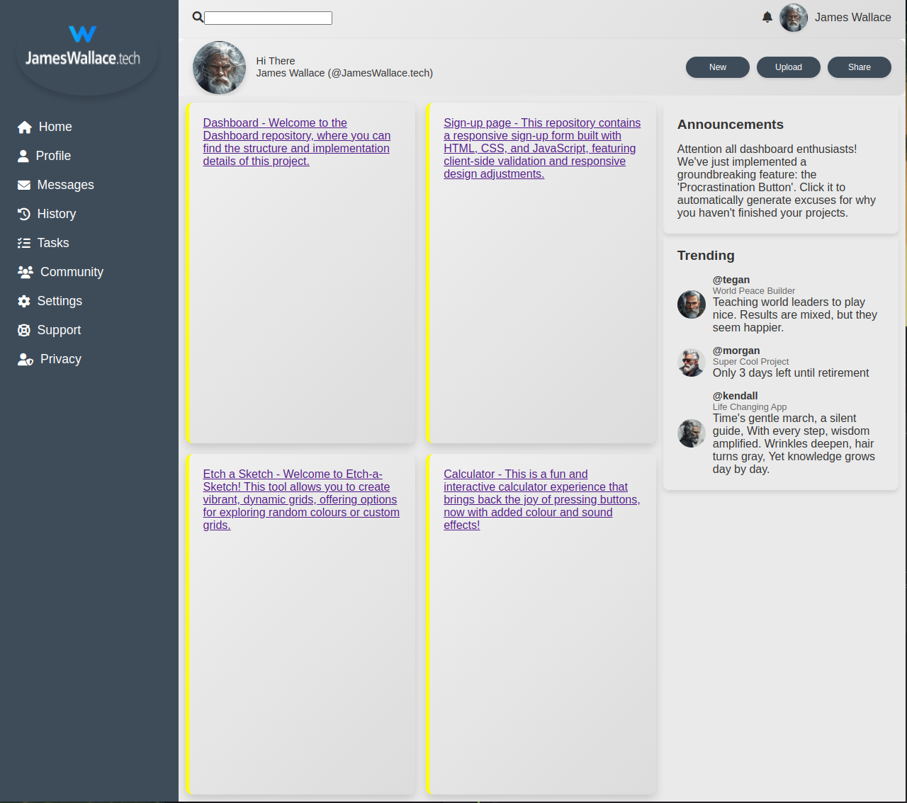

# JamesWallace.tech Dashboard

## Project Overview

This repository contains the source code for the JamesWallace.tech dashboard mockup, 
## Features

- **Responsive Design**: Adapts to different screen sizes for optimal viewing on desktop and mobile devices.
- **Project Showcase**: Displays multiple projects with descriptions and links.

## Project Structure

The dashboard consists of several key components:

1. **Dashboard**: The main landing page displaying an overview of projects.
2. **Sign-up Page**: A responsive form for new user registration.
3. **Etch-a-Sketch**: An interactive drawing tool with customizable options.
4. **Calculator**: A functional calculator with added color and sound effects.

## Technologies Used

- HTML5
- CSS3 (with CSS Grid and Flexbox for layout)
- JavaScript (for interactivity and form validation)

- ## Screenshot

